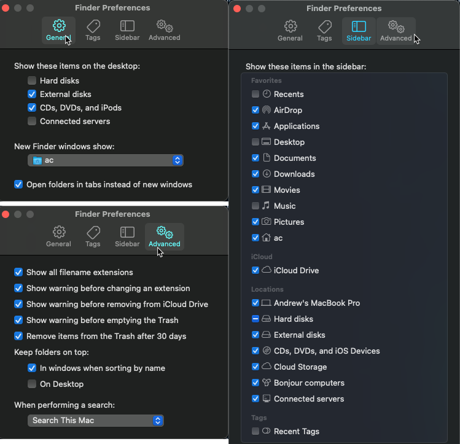

# MacOS Buildout

This repo acts as a log for my buildout of my laptop. As I add stuff or change settings, I log it here so pave & restores can go quickly in the future. Feel free to fork & customize to your liking.

More background info: [BLOG: Rapid Complete Install / Reinstall OS X Like a Champ in Three-ish Hours](http://www.andrewconnell.com/blog/rapid-complete-install-reinstall-os-x-like-a-champ-in-three-ish-hours)

## Before Paving, document current config

Do the following before paving the partition. This is to get the way I have things configured in the dock & menu bar back the way I want them.

- Set up timestamped backup folder, **{{PRIVATE_BACKUP}}**, OneDrive to copy things
- Screenshot all installed apps
- Screenshot OneDrive sync'd doclib's from MS Teams & save => **{{PRIVATE_BACKUP}}**
- XCOPY the following => **{{PRIVATE_BACKUP}}**
  > **NOTE:** many of the hidden files & folders are copied as "dot-files"

  - `~/_play`
  - `~/.gitconfig`
  - `~/.gitmessage`
  - `~/.npmrc`
  - `~/.ssh`
  - `~/.yarnrc`
  - `~/.zsh`
  - `~/.zprofile`
  - `~/.zshenv`
  - `~/.zshrc`
  - `~/Movies`
  - `~/voitanos-workspace`
  - *review other folders in the root*
- Dev
  - Dump list of all repos in `~/repos` => **{{PRIVATE_BACKUP}}/{{BACKUPDATE}}**
  - Clone all repos (+ upstream remotes) using this script: [scripts/repo-gen-clone-script.zsh](./repo-gen-clone-script.zsh)
- iStat Menu
  - backup settings => **{{PRIVATE_BACKUP}}/iStat Menus Settings.ismp**
- Node
  - refresh NPM global package install list: **./scripts/npm-install-packages-lts-*.zsh**

    ```console
    npm list -g --depth=0
    ```

- Copy virtual machines => external storage
- Postman
  - export all collections & environments => **{{PRIVATE_BACKUP}}/Postman-backup.zip**
- Screenflow
  - log batch export settings to **[./AppSettings/Screenflow](./AppSettings/Screenflow)**
- Stream Deck
  - export & save Stream Deck profiles => **{{PRIVATE_BACKUP}}/Stream Deck - {{..}}.streamDeckProfilesBackup**
- Visual Studio Code
  - refresh installed extensions install list: **[./scripts/vscode-ext-install.zsh](./scripts/vscode-ext-install.zsh)**

      ```console
      code --list-extensions
      ```

  - backup snippets & user settings to **{{PRIVATE_BACKUP}}/VisualStudioCode**
    - user settings: `~/Library/Application Support/Code/User`

### MacOS & System

- have a current Apple TimeMachine backup job finished
- screenshots of Finder settings

    

- screenshot MacOS dock

    

- screenshot expanded Bartender MacOS Menu Bar

    

### Installed apps

- get list of all apps installed via Homebrew:

  ```console
  brew leaves
  ```

### Adobe Creative Cloud

- Launch each app and sync settings (PUSH) for:
  - Media Encoder
  - Photoshop
  - Premiere Pro
- Photoshop:
  - export saved actions: **[./AppSettings/AdobeCreativeCloud/Photoshop](./AppSettings/AdobeCreativeCloud/Photoshop)**
- Premiere Pro:
  - export custom presets: **[./AppSettings/AdobeCreativeCloud/PremierePro](./AppSettings/AdobeCreativeCloud/PremierPro)**
- Jump Desktop
- export list of VMs => **{{PRIVATE_BACKUP}}**
- Mac App Store apps
- refresh list installed MacOS apps: **[./scripts/macos-install.zsh](./scripts/macos-install.zsh)**

    ```console
    mas list
    ```

## Pave partition

1. restart with <kbd>⌘</kbd>+<kbd>R</kbd>
1. go to **Disk Utility**
1. select the main drive, then select **Erase** > **Erase Volume Group**
1. create new ADFS volume
1. install MacOS via internet

## Install apps

The following installs & configuration should be done to setup automated installs.

### If installing on Apple Silicon

Install Rosetta 2

```console
sudo softwareupdate --install-rosetta
```

### Homebrew & Homebrew Cask

Install [Homebrew](http://brew.sh/) for automated installs & updates.

```console
/bin/bash -c "$(curl -fsSL https://raw.githubusercontent.com/Homebrew/install/HEAD/install.sh)"
```

> [!TIP]
> If get error about `zsh compinit: insecure directories, run compaudit for list.`, do what it says:
>
> `$ compaudit`
>
> For the folder(s) returned, fix it with:
>
> `$ sudo chmod -R 755 {PATH}`

### Install fonts

```console
curl -L https://raw.githubusercontent.com/andrewconnell/osx-install/master/scripts/core-fonts.zsh | zsh
```

### Install & setup console

Installs ideal shell, prompt, and terminals

> **NOTE**: Monitor the terminal for password prompts & errors/warnings.

1. run following to install cores

    ```console
    curl -L https://raw.githubusercontent.com/andrewconnell/osx-install/master/scripts/core-install.zsh | zsh
    ```

1. copy the **[dotfiles & folders](./dotfiles/)** (overwriting existing) into home folder

### Install apps via Homebrew: `homebrew-install-apps.zsh`

Install apps using Homebrew.

> **NOTE**: Monitor the terminal for password prompts & errors/warnings.

run following to install cores

  ```console
  curl -L https://raw.githubusercontent.com/andrewconnell/osx-install/master/scripts/homebrew-install-apps.zsh | zsh
  ```

Pay attention for extra installs & steps at the end.

### Install Mac App Store apps: `macos-install.zsh`

Install apps from the Apple App Store.

```console
curl -L https://raw.githubusercontent.com/andrewconnell/osx-install/master/scripts/macos-install.zsh | zsh
```

### Manual Installs

- Amphetamine Enhancer - https://github.com/x74353/Amphetamine-Enhancer
- [Sophos Home A/V](https://home.sophos.com)

## Configure apps

Three step process:

1. Get OneDrive syncing to get access to backups, settings (in OneDrive), licenses & passwords in password manager
1. Login, license, install, & configure remaining apps

### Configure core apps to acquire backups, licenses & passwords

- login to the following apps
  - Google Chrome
    - *do this first & login to password manager to get licenses*
  - OneDrive
    - *do this to get sync running... contains backup files collected before pave*
- Visual Studio Code
  - install extensions collected before pave:

      ```console
      curl -L https://raw.githubusercontent.com/andrewconnell/osx-install/master/scripts/vscode-ext-install.zsh | zsh
      ```

  - copy snippets & settings:
    - from **[./AppSettings/VisualStudioCode](./AppSettings/VisualStudioCode)**
    - to `~/Library/Application Support/Code/User`
  - apply licenses to extensions Quokka & Wallaby

### Setup SSH

- setup SSH keys
  - copy backed up `./.ssh` keys from **{{PRIVATE_BACKUP}}** => `./.ssh`
  - configure SSH keys

      ```console
      # set permission to make my keys private
      sudo chmod 400 ~/.ssh/id_rsa

      # configure 'config' folder permissions
      sudo chmod 600 ~/.ssh/config

      # add key to SSH agent
      #     + enter passphrase from password manager when prompted
      ssh-add ~/.ssh/id_rsa

      # add to keychain
      ssh-add -K
      ```

### Configure Installed Apps

- Alfred
  - Activate power pack within app settings
  - **Preferences > Advanced**: Syncing - set to **./{{PRIVATE-BACKUP}}/Alfred**
- Amphetamine

    

    

    

    

    

- iStat Settings
  - license & restore settings: [./AppSettings/iStat Menus Settings.ismp](./AppSettings/iStat%20Menus%20Settings.ismp)
- Bartender
  - License & configure:

      

- Control Center
  - Open & configure to launch at login
- Divvy
  - import shortcuts by opening Safari / Firefox & enter the url in [./AppSettings/divvy.md](./AppSettings/divvy.md)

    

- Jump Desktop
  - import the machines from export before pave
- Microsoft Outlook

    

    

    

    

    

    

    

  - Signature
    - get signatures from previous "sends"

- Microsoft Teams
- Parcel
- Screenflow
  - license
  - create custom batch export profile
- Slack
- Steam
  - Launch & login
  - Disable auto login: **Preferences > Interface > [uncheck] Run Steam with my computer starts**
- Stream Deck
  - restore profiles
  - install plugins from Stream Deck store:
    - Home Assistant
    - Phillips Hue
    - VLC

## Additional downloads & installs: `scripted-installs.zsh`

```console
curl -L https://raw.githubusercontent.com/andrewconnell/osx-install/master/scripts/scripted-installs.zsh | zsh
```

### Install custom fonts

- Open `~/Library/Fonts`
- For the following folders, select all fonts files, open in macOS' **Font Book**, & install them:
  - AC Handwriting
  - Omnes
  - Segoe UI MDL2

### Creative Cloud installs

- Install apps:
  - Acrobat DC
  - After Effects
  - Audition
  - Bridge
  - Illustrator
  - Media Encoder
  - Photoshop
  - Premiere Pro
- Import settings from the pre-pave section above on [Adobe CC apps](#adobe-creative-cloud)
- Manually install **[aescripts + aeplugins](https://aescripts.com/)** manager, login & install plugins

## Install Node

Manage node installs using NVM... this lets me test different versions of node as well as avoid issue with having to use `sudo` when installing packages globally.

```console
mkdir ~/.nvm
```

### Install & configure Node LTS & stable versions

> [!CAUTION]
> The following script doesn't work. Something is causing `nvm` to not be seen as a valid comment.
>
> Instead, copy the blocks of code from the following installer script file and manually run in the console.

This script installs multiple Node versions:

```console
curl -L https://raw.githubusercontent.com/andrewconnell/osx-install/master/scripts/node-install.zsh | zsh
```

## Post installation & configuration checks

### Update Homebrew, Homebrew Cask & purge installs

```console
brew doctor
brew update
brew cleanup
```

### Setup git

> NOTE: This might already be done by copying the hidden **~./.gitconfig**.

```console
git config --global user.name "Andrew Connell"
git config --global user.email <insert primary email>
git config --global credential.helper osxkeychain
# set VSCode as commit message editor & merge tool
git config --global core.editor "code -w"
git config --global merge.tool code
```

### MacOS Tweaks

- Desktop (*change these settings by right-click desktop & pick **Show View Options***)

    

- System Preferences
  - Accessibility

      

  - Dock
    - settings: **System Preferences > Dock**

        

    - update dock to the backup image

        

  - General

      

  - Keyboard

      

    - Shortcuts - uncheck options for Spotlight, then manually setup activation keystroke for Alfred to <kbd>CMD</kbd>+<kbd>SPACE</kbd>

        

  - Mission Control

      

  - Internet Accounts

      

  - Printers
    - install / add printers
  - Security > Privacy
    - Activate & enable where necessary
  - Users & Groups / Login Items

      

### Data Restore

- Clone select repositories from github => `~/repos`

### Setup TimeMachine Backups

Run first backups.

## Ongoing... HOWTO Keep Things Updated

to keep Homebrew installed things update, do this:

  ```console
  brew update           # download app updated formulas
  brew outdated         # what's old?
  brew upgrade          # upgrade everything locally
  # list all brew casks installed & their versions
  brew cask outdated
  brew cask upgrade
  # cleanup everything
  brew cleanup
  ```

update MacOS apps:

  ```console
  mas outdated    # what's old
  mas upgrade     # upgrade everything
  ```

update MacOS: [ref](https://developer.apple.com/legacy/library/documentation/Darwin/Reference/ManPages/man8/softwareupdate.8.html)

  ```console
  softwareupdate --list
  # install things based on the name returned using
  sudo softwareupdate --install [name listed]
  ```
