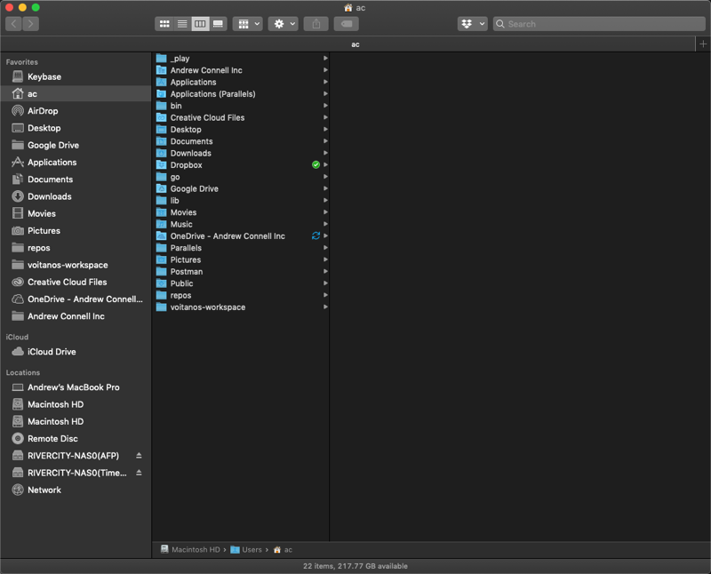
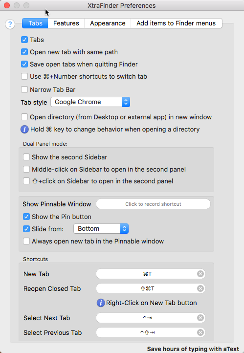
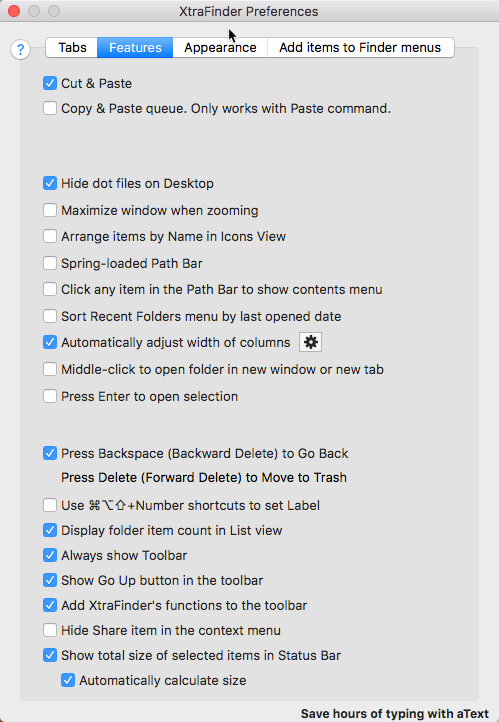

# MacOS Buildout

This repo acts as a log for my buildout of my laptop. As I add stuff or change settings, I log it here so pave & restores can go quickly in the future. Feel free to fork & customize to your liking.

More background info: [BLOG: Rapid Complete Install / Reinstall OS X Like a Champ in Three-ish Hours](http://www.andrewconnell.com/blog/rapid-complete-install-reinstall-os-x-like-a-champ-in-three-ish-hours)

## Before Paving the primary partition...

Do the following before paving the partition. This is to get the way I have things configured in the dock & menu bar back the way I want them.

- MacOS & System
  - have a current Apple TimeMachine & CrashPlan backup job finished
  - screenshot Finder layout

    
  
  - screenshots of Finder settings

    

    

    

  - screenshots of Finder settings

    
    
    
    
    

  - screenshot MacOS dock

    

  - screenshot expanded Bartender MacOS Menu Bar

    

- XCOPY to external disk if possible (faster than downloading from CrashPlan)

  - `~/.gitconfig`
  - `~/.ssh`
  - `~/.zshrc`
  - `~/Desktop`
  - `~/Dev`
  - `~/Downloads`
  - `~/Documents`
  - `~/lib`
  - `~/Pictures`
  - optional
    - `~/.angular-cli.json`
    - `~/_play`
    - `~/Movies`
    - `~/repos`
    - *review other folders in the root*
- Dev
  - Dump list of all repos in `~/repos`
- Node
  - get list of all globally installed NPM packages

    ```shell
    $ npm list -g --depth=0
    ```
  
  - use that list to update the npm script: [app-settings/npminstall.sh](app-settings/npminstall.sh)

- visual-studio-code
  - get list of all installed extensions and update the list in [scripts/vscode-ext-install.sh](scripts/vscode-ext-install.sh)
    - get a list using `$ code --list-extensions`
    - sort alphabetically
    - update the file `vscode-ext-install.sh`
  - backup snippets & user settings to [app-settings/visual-studio-code](app-settings/visual-studio-code)

## Pave Partition

1. restart with COMMAND+R
1. when apple logo comes up... delete partition, NOT tiny partition (2nd listed)
1. back up and install MacOS via network

## After Pave, Install the Following

The following installs & configuration should be done to setup automated installs.

### Homebrew & Homebrew Cask

Install [Homebrew](http://brew.sh/) for automated installs & updates.

```shell
curl -L https://raw.githubusercontent.com/andrewconnell/osx-install/master/scripts/homebrew-install.sh | sh
```

### Setup Command Prompt

Install ZSH, Oh My ZSH, iTerm & copy fonts & themes:

```shell
curl -L https://raw.githubusercontent.com/andrewconnell/osx-install/master/scripts/cmdprompt-install.sh | sh
```

- iTerm
  - import settings from `~/Dropbox/My AppSettings/iTerm`
  - apply custom **bullet-train** theme
    - update `~/.zshrc` to specify the theme used: `ZSH_THEME="bullet-train"`
  - update SSH
    - copy the `~/.ssh` keys into the new location
    - reset permissions & add private key to keychain:

      ```shell
      sudo chmod 600 ~/.ssh/id_rsa
      ssh-add -K ~/.ssh/id_rsa
      ```

## Install Core Apps: `coreinstall.sh`

```shell
curl -L https://raw.githubusercontent.com/andrewconnell/osx-install/master/scripts/coreinstall.sh | sh
```

## Configure Core Apps

- login to the following:
  - Chrome
    - *do this first & login to LastPass to get licenses*
  - Dropbox
  - Google-drive
  - Skype
- Alfred
  - Activate power pack within app settings
  - **Preferences > Advanced**: Syncing - set to `~/Dropbox/My AppSettings/Alfred`
- Amphetamine

  

  

  

- Bartender
  - License & configure (*[use this image for reference](images/macOS-MenuBar.png)*)
- NoSleep
  - Launch & configure (*[use this image for reference](images/NoSleep.png)*)
- Outlook

  

  

  

  

  

  

  

- Steam
  - Launch & login
  - Disable auto login: **Preferences > Interface > [uncheck] Run Steam with my computer starts**
- Sublime Text
  - add license
  - [package control](https://packagecontrol.io/)
  - install packages:
    - BracketHighlighter
    - Git
    - Indent XML
    - Markdown Preview
    - MarkdownEditing
    - Preference Helper
    - Pretty JSON
    - SnippetMaker
    - SublimeCodeIntel
    - Theme-Spacegray
    - TypeScript
    - View In Browser
  - Update preferences from those in [app-settings/sublime](app-settings/sublime)
    - copy to `~/Library/Application Support/Sublime Text`
- Xtrafinder
  - Reboot to recovery OS: reboot & hold COMMAND+R
  - select **Utilities => Terminal**
  - enter `csrutil enable --without debug
  - reboot

## Install App Store

Install this stuff from the Apple App Store, then run the next install scripts... while they run, configure these.

- Amphetamine
- CCMenu
- Disk Map
- Display Menu
- Divvy
  - import shortcuts by opening Safari / Firefox & enter the url in [app-settings/divvy-shortcuts.md](app-settings/divvy-shortcuts.md)
- Jump Desktop
  - then sync the machines from folder in dropbox
- Kindle
- Parcel
  - *login*
- WeatherClip
	- *launch and configure*

## Install My Personal Apps: `myinstall.sh`

```shell
curl -L https://raw.githubusercontent.com/andrewconnell/osx-install/master/scripts/myinstall.sh | sh
```

- license Synergy
- login Slack
- login Steam
- restore iStat Settings [app-settings/iStat Menus Settings.ismp](app-settings/iStat Menus Settings.ismp)

## Install Dev Apps: `devinstall.sh`

```shell
curl -L https://raw.githubusercontent.com/andrewconnell/osx-install/master/scripts/devinstall.sh | sh
```

- Creative Cloud installs
  - Acrobat DC
  - After Effects CC
  - Audition CC
  - Bridge CC
  - Illustrator CC
  - Lightroom CC
  - Media Encoder
  - Photoshop CC
  - Prelude CC
  - Premiere Pro CC
- launch
  - Docker for MacOS
  - Duet
- license
  - Balsamiq-mockups
  - Camtasia
  - Charles
  - Screenflow
  - SmartGit
  - SmartSynchronize
- setup
  - Creative-Cloud
    - import settings from Adobe CC, Adobe Media Encoder - import preferences from [app-settings/adobe-creative-suite](app-settings/adobe-creative-suite)
- Visual Studio
  - open & login with O365 account
  - change updates to alpha channel
- Visual Studio Code
  - install [Hack font](http://sourcefoundry.org/hack/)
    - font found in [app-settings](app-settings) as **Hack-*-otf.zip**
  - Launch VS Code
    - from command pallet, find **Shell Command**
      - uninstall & reinstall command in path
      - *repeat the above for VS Code Insiders*
    - install extensions:

      ```shell
      curl -L https://raw.githubusercontent.com/andrewconnell/osx-install/master/scripts/vscode-ext-install.sh | sh
      ```
  - copy snippets & settings:
    - from [app-settings/visual-studio-code](app-settings/visual-studio-code)
    - to `~/Library/Application Suport/Code/User`
    - *add license key for WallabyJS*
      - repeat for VSCode Insiders install

### Setup Azure-cli AutoComplete:

```shell
$ echo '. <(azure --completion)' >> .zshrc
```

## Manual Installs

- Amazon Music
  - install located in `~/Dropbox/My AppSettings/_Installs`
- Call Recorder (for skype)
  - install located in `~/Dropbox/My AppSettings/_Installs`
- Powermate
  - install located in `~/Dropbox/My AppSettings/_Installs`
- Mac Office

    > Install this from Office 365... not sure if acts differently from the homebrew cask `microsoft-office`... 
    > *might be easier to use homebrew?*

  - Outlook configuration
    - General
      - uncheck "group similar folders from different accounts"
      - check "hide on my computer folders"
    - Font
      - color: = navy
      - size: = 11.5
    - Notifications & Sounds: uncheck all except for reminder
    - Reading
      - set to mark as read only when opening in seperate window
    - Signature
    - Signin to Skype for Business
- TechSmith SnagIt
  - get by logging into [TechSmith](http://www.techsmith.com)
  - then launch to license
- BitDefender
  - install located in `~/Dropbox/My AppSettings/_Installs`

## Install Node

manage node installs using nvm... this lets me test different versions of node as well as avoid issue with having to use `sudo` when installing packages globally

```shell
curl -L https://raw.githubusercontent.com/andrewconnell/osx-install/master/scripts/nvm-install.sh | sh
```

make sure this is at the very end of `.zshrc`

```shell
$ export NVM_DIR="$HOME/.nvm"
$ . "/usr/local/opt/nvm/nvm.sh"
```

install node LTS and stable versions:

```shell
curl -L https://raw.githubusercontent.com/andrewconnell/osx-install/master/scripts/nodeinstall.sh | sh
```

now install global packages for each version of node installed:

```shell
curl -L https://raw.githubusercontent.com/andrewconnell/osx-install/master/scripts/npm-install.sh | sh
```


## After all Installs, Update Brew, Brew Cask & Purge Installs

```shell
brew doctor
brew update
brew cleanup
brew cask cleanup
```

## Setup git:

> might already be done by copying the hidden files over

```shell
git config --global user.name "Andrew Connell"
git config --global user.email <insert primary email>
git config --global credential.helper osxkeychain
# set VSCode as commit message editor & merge tool
git config --global core.editor "code -w"
git config --global merge.tool code
```

## MacOS Tweaks

- Desktop (*change these settings by right-click desktop & pick options*)
  - set icon size 40x40
  - grid spacing - midpoint
  - check SHOW ITEM INFO
- Finder
  - mirror what is in the screenshot [macOS-Finder.png](macOS-Finder.png)
- Menu Bar / Bartender
  - mirror what is in the screenshot [macOS-MenuBar.png](macOS-MenuBar.png)
- System Preferences
  - Accessibility
    - Zoom: check the following
      - use keyboard shortcuts to Zoom
      - use scroll gesture with modifier keys to zoom (select ^ CONTROL)
  - Display
    - set scale for laptop LCD to max (furthest right)
  - Dock
    - size 30%
    - magnification 80%
    - minimize windows = genie effect
    - animate opening apps
    - auto hide & show
    - show indicators for open apps
    - mirror what is in the screenshot [macOS-Dock.png](macOS-Dock.png)
  - General
    - check *Use dark menu bar & dock*
  - Keyboard
    - General:
      - Key repeat: 100% fast
      - Delay until repeat: 2nd tick from right
      - CHECK Use all F1, F2, etc keys as standard function keys
    - Mission Control
      - disable Mission Control & Application Windows options
        - *these hijack the multi-line cursor ability in Sublime Text*
    - Shortcuts - uncheck options for Spotlight 
      - Set activation keystroke for Alfred: CMD+SPACE
  - Internet Accounts
    - iCloud
    - O365 <primary account>
    - gmail <primary account>
    - facebook
    - twitter <primary account>
    - facebook
    - don’t do linkedin... too many damn birthday alerts!
  - Printers
    - install / add printers
  - Security > Privacy
    - CheatSheet
    - Divvy
    - Dropbox
    - SnagIt & SnagItHelper
    - Synergy
  - Users & Groups / Login Items
    - Alfred 3
    - Bartender
    - Crashplan menu bar
    - Divvy
    - Dropbox
    - Duet
    - Google Chrome (hide = checked)
    - Google Drive
    - iTunesHelper
    - No Sleep
    - Skype for Business
    - The Clock
    - TripMode
    - WeatherClip

## Data Restore

- clone select repositories from github => `~/repos`
- restore all data from Crashplan => `~/`

## Setup Backups
- Time Machine
- CrashPlan
  - backup everything in home directory: `~/`
  - EXCLUDE these folders
    - Applications
    - Creative Cloud Files
    - Dropbox
    - Google Drive
    - Library
    - OneDrive
    - OneDrive for Business
    - Movies
    - Music
    - Public
    - repos

Run first backups.

## Ongoing... HOWTO Keep Things Updated

to keep homebrew installed things update, do this:

  ```shell
  brew update           # download app updated formulas
  brew outdated         # what’s old?
  brew upgrade          # upgrade everything locally
  # list all brew casks installed & their versions
  brew cu --dry-run
  # optionally update everything
  brew cu
  # cleanup everything
  brew cleanup
  ```

[](https://github.com/igrigorik/ga-beacon)
