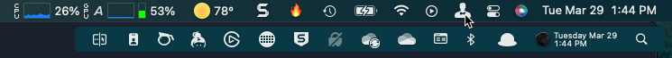

# MacOS Buildout

This repo acts as a log for my buildout of my laptop. As I add stuff or change settings, I log it here so pave & restores can go quickly in the future. Feel free to fork & customize to your liking.

More background info: [BLOG: Rapid Complete Install / Reinstall OS X Like a Champ in Three-ish Hours](http://www.andrewconnell.com/blog/rapid-complete-install-reinstall-os-x-like-a-champ-in-three-ish-hours)

## Before Paving the primary partition...

Do the following before paving the partition. This is to get the way I have things configured in the dock & menu bar back the way I want them.

- MacOS & System
  - have a current Apple TimeMachine & CrashPlan backup job finished
  - screenshot MacOS dock

    

  - screenshot expanded Bartender MacOS Menu Bar

    

- XCOPY to local disk if possible (faster than downloading from CrashPlan)
  - `~/.bashrc`
  - `~/.gitconfig`
  - `~/.ssh`
  - `~/.zshrc`
  - `~/Desktop`
  - `~/Dev`
  - `~/Downloads`
  - `~/Documents`
  - `~/Pictures`
- Dev
  - Dump list of all repos in `~/repos`
- Node
  - get list of all globally installed NPM packages

    ```bash
    $ npm list -g --depth=0
    ```
  
  - use that list to update the npm script: [app-settings/npminstall.sh](app-settings/npminstall.sh)

- visual-studio-code
  - get list of all installed extensions and update the list in [vscode-extensions.md](vscode-extensions.md)
  - backup snippets & user settings to [app-settings/visual-studio-code](app-settings/visual-studio-code)

## Pave Partition

1. restart with COMMAND+R
1. when apple logo comes up... delete partition, NOT tiny partition (2nd listed)
1. back up and install MacOS via network

## After Pave, Install the Following

The following manual installs & configuration should be done to setup automated installs.

### Homebrew & Homebrew Cask

Install [Homebrew](http://brew.sh/) for automated installs & updates. 

```shell
ruby -e "$(curl -fsSL https://raw.githubusercontent.com/Homebrew/install/master/install)"
brew doctor

brew tap caskroom/cask
brew install caskroom/cask/brew-cask
brew doctor
```

## Install Core Apps

- run script [coreinstall.sh](scripts/coreinstall.sh)
  - run using `$ sh coreinstall.sh`

## Configure Core Apps

- login to the hollowing:q
  - Chrome
    - *do this first & login to LastPass to get licenses*
  - Dropbox
  - Google-drive
  - Skype
- Alfred
  - Activate power pack within app settings
- Bartender
  - License & configure (*[use this image for reference](images/macOS-MenuBar.png)*)
- iTerm
  - copy fonts from [iterm/Source Code Pro Fonts](app-settings/iterm/Source Code Pro Fonts) => `~/Library/Fonts`
  - import color profiles from [iterm](app-settings/iterm)
  - [setup iTerm with oh-my-zsh & powerline](https://www.xplatform.rocks/2015/05/07/setting-up-iterm2-with-oh-my-zsh-and-powerline-on-osx)
  - import settings from ~/Dropbox/My AppSettings/iTerm
- NoSleep
  - Launch & configure (*[use this image for reference](images/NoSleep.png)*)
- Sublime Text
  - add license
  - [package control](https://packagecontrol.io/)
  - install packages:
    - BracketHighlighter
    - Git
    - Indent XML
    - Markdown Preview
    - MarkdownEditing
    - Preference Helper
    - Pretty JSON
    - SnippetMaker
    - SublimeCodeIntel
    - Theme-Spacegray
    - TypeScript
    - View In Browser
  - Update preferences from those in [app-settings/sublime](app-settings/sublime)
    - copy to `~/Library/Application Support/Sublime Text`

## Install App Store

Install this stuff from the Apple App Store, then run the next install scripts... while they run, configure these.

- CCMenu
- Display Menu
- Divvy
  - *then import shortcuts by opening Safari / Firefox & enter the url in [app-settings/divvy-shortcuts.md](app-settings/divvy-shortcuts.md)*
- Jump Desktop
  - *then sync the machines from folder in dropbox*
- Kindle
- Parcel
  - *login*
- The Clock
  - *restore settings form [app-settings/the_clock_settings.tclk](app-settings/the_clock_settings.tclk)*
- WeatherClip
	- *launch and configure*

## Install My Personal Apps

Run script [myinstall.sh](scripts/myinstall.sh)

- license Synergy
- login Slack
- login Steam

## Install Dev Apps

Run script [devinstall.sh](scripts/devinstall.sh)

- Creative Cloud installs
  - Acrobat
  - Audition
  - Bridge
  - Lightroom
  - Media Encoder
  - Photoshop
  - Premiere Pro
- launch
  - Docker for MacOS
  - Duet
- license
  - Camtasia
  - Screenflow
  - Charles
  - Balsamiq-mockups
  - Smartgit
  - SmartSynchronize
- setup
  - Creative-Cloud
    - import settings from Adobe CC, Adobe Media Encoder - import preferences from [app-settings/adobe-creative-suite](app-settings/adobe-creative-suite)
- Visual Studio Code
  - install [Hack font](http://sourcefoundry.org/hack/)
    - font found in [app-settings](app-settings) as **Hack-*-otf.zip**
  - copy snippets & settings:
    - from [app-settings/visual-studio-code](app-settings/visual-studio-code)
    - to `~/Library/Application Suport/Code/User`
  - install extensions listed in [vscode-extensions.md](vscode-extensions.md)
    - *add license key for WallabyJS*

### Setup Azure-cli AutoComplete:

	```bash
	$ echo '. <(azure --completion)' >> .zshrc
	```

## Manual Installs

- Amazon Music
  - install located in `~/Dropbox/My AppSettings/_Installs`
- Call Recorder (for skype)
  - install located in `~/Dropbox/My AppSettings/_Installs`
- Powermate
  - install located in `~/Dropbox/My AppSettings/_Installs`
- Mac Office

    > Install this from Office 365... not sure if acts differently from the homebrew cask `microsoft-office`... 
    > *might be easier to use homebrew?*

  - Outlook configuration
    - General
      - uncheck "group similar folders from different accounts"
      - check "hide on my computer folders"
    - Font
      - color: = navy
      - size: = 11.5
    - Notifications & Sounds: uncheck all except for reminder
    - Reading
      - set to mark as read only when opening in seperate window
    - Signature
- Skype for Business
  - install located in `~/Dropbox/My AppSettings/_Installs`
- TechSmith SnagIt
  - get by logging into [TechSmith](http://www.techsmith.com)
  - then launch to license
- BitDefender
  - install located in `~/Dropbox/My AppSettings/_Installs`

## Install Node

manage node installs using nvm... this lets me test different versions of node as well as avoid issue with having to use `sudo` when installing packages globally

`brew install nvm`

make sure this is at the very end of `.zshrc`

```
export NVM_DIR=~/.nvm
source $(brew --prefix nvm)/nvm.sh
```

install the latest version of node, for instance:

```
# list all available installs
nvm ls-remote
# install latest version
nvm install v4.2.1
```

now run [npminstall.sh](scripts/npminstall.sh) to install packages globally


## After all Installs, Update Brew, Brew Cask & Purge Installs

```bash
brew update
brew upgrade brew-cask
brew cleanup
```

## Setup git:

```bash
git config --global user.name "Andrew Connell"
git config --global user.email <insert primary email>
git config --global credential.helper osxkeychain
# set VSCode as commit message editor & merge tool
git config --global core.editor "code -w"
git config --global merge.tool code
```

## MacOS Tweaks

- Desktop (*change these settings by right-click desktop & pick options*)
  - set icon size 40x40
  - grid spacing - midpoint
  - check SHOW ITEM INFO
- Security & Privacy
  - Divvy
  - Dropbox
  - SnagIt & SnagItHelper
  - Synergy
- System Preferences
  - Display
    - set scale for laptop LCD to max (furthest right)
  - Dock
    - size 30%
    - magnification 80%
    - minimize windows = genie effect
    - animate opening apps
    - auto hide & show
    - show indicators for open apps
  - General
    - check *Use dark menu bar & dock* 
  - Keyboard
    - General:
      - Key repeat: 100% fast
      - Delay until repeat: 2nd tick from right
      - CHECK Use all F1, F2, etc keys as standard function keys
    - Mission Control
      - disable Mission Control & Application Windows options
        - *these hijack the multi-line cursor ability in Sublime Text*
    - Shortcuts - uncheck options for Spotlight 
      - Set activation keystroke for Alfred: CMD+SPACE
  - Internet Accounts
    - iCloud
    - O365 <primary account>
    - gmail <primary account>
    - facebook
    - twitter <primary account>
    - facebook
    - don’t do linkedin... too many damn birthday alerts!
  - Printers
    - install / add printers
- Users & Groups / Login Items
  - Alfred 3
  - Bartender
  - Crashplan menu bar
  - Divvy
  - Dropbox
  - Duet
  - Google Chrome (hide = checked)
  - Google Drive
  - iTunesHelper
  - No Sleep
  - Skype for Business
  - The Clock
  - TripMode
  - WeatherClip

## Data Restore

- clone select repositories from github => `~/repos`
- restore all data from Crashplan => `~/`

## Setup Backups
- Time Machine
- CrashPlan
  - backup everything in home directory: `~/`
  - EXCLUDE these folders
    - Applications
    - Creative Cloud Files
    - Dropbox
    - Google Drive
    - Library
    - OneDrive
    - OneDrive for Business
    - Movies
    - Music
    - Public
    - repos

Run first backups.

## Ongoing... HOWTO Keep Things Updated

to keep homebrew installed things update, do this:

  ```bash
  brew update       	# download app updated formulas
  brew outdated     	# what’s old?
  brew upgrade --all	# upgrade everything locally
  # because you can't upgrade casks, just reinstall everything you have installed
  brew cask list | xargs brew cask install --force
  # cleanup everything
  brew cleanup
  ```

[](https://github.com/igrigorik/ga-beacon)
