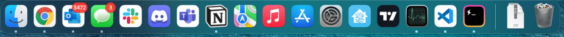

# MacOS Buildout

This repo acts as a log for my buildout of my laptop. As I add stuff or change settings, I log it here so pave & restores can go quickly in the future. Feel free to fork & customize to your liking.

More background info: [BLOG: Rapid Complete Install / Reinstall OS X Like a Champ in Three-ish Hours](http://www.andrewconnell.com/blog/rapid-complete-install-reinstall-os-x-like-a-champ-in-three-ish-hours)

## Before Paving, document current config

Do the following before paving the partition. This is to get the way I have things configured in the dock & menu bar back the way I want them.

- Set up timestamped backup folder, **{{PRIVATE_BACKUP}}**, OneDrive (or similar) to copy things
- Screenshot all installed apps
- Screenshot OneDrive sync'd doclib's from MS Teams & save => **{{PRIVATE_BACKUP}}**
- XCOPY the following => **{{PRIVATE_BACKUP}}**
  > **NOTE:** many of the hidden files & folders are copied as "dot-files"

  - `~/.bash_history`
  - `~/.bash_profile`
  - `~/.gitconfig`
  - `~/.npmrc`
  - `~/.yarnrc`
  - `~/.ssh`
  - `~/.zshrc`
  - `~/_play`
  - `~/Desktop`
  - `~/Downloads`
  - `~/Documents`
  - `~/Movies`
  - `~/voitanos-workspace`
  - *review other folders in the root*
- Dev
  - Dump list of all repos in `~/repos` => **{{PRIVATE_BACKUP}}**
- iStat Menu
  - backup settings => **./AppSettings/iStat Menus Settings.ismp**
- Node
  - refresh NPM global package install list: **[./scripts/npm-global-package-install.sh](./scripts/npm-global-package-install.sh)**

    ```bash
    $ npm list -g --depth=0
    ```

- Postman
  - export all collections & environments
- Screenflow
  - log batch export settings to **[./AppSettings/Screenflow](./AppSettings/Screenflow)**
- Visual Studio Code
  - refresh installed extensions install list: **[./scripts/vscode-ext-install.sh](./scripts/vscode-ext-install.sh)**

      ```bash
      $ code --list-extensions
      ```

  - backup snippets & user settings to **[./AppSettings/VisualStudioCode](./AppSettings/VisualStudioCode)**
    - user settings: `~/Library/Application Support/Code/User`

### MacOS & System

- have a current Apple TimeMachine backup job finished
- screenshots of Finder settings

    

    

    

- screenshot MacOS dock

    

- screenshot expanded Bartender MacOS Menu Bar

    

### Adobe Creative Cloud

- Launch each app and sync settings (PUSH) for:
  - Media Encoder
  - Photoshop
  - Prelude
  - Premiere Pro
- Media Encoder:
  - export all profiles: **[./AppSettings/AdobeCreativeCloud/MediaEncoder](./AppSettings/AdobeCreativeCloud/MediaEncoder)**
- Photoshop:
  - export saved actions: **[./AppSettings/AdobeCreativeCloud/Photoshop](./AppSettings/AdobeCreativeCloud/Photoshop)**
- Premiere Pro:
  - export custom presets: **[./AppSettings/AdobeCreativeCloud/PremierePro](./AppSettings/AdobeCreativeCloud/PremierPro)**
- Jump Desktop
- export list of VMs => **{{PRIVATE_BACKUP}}**
- Mac App Store apps
- refresh list installed MacOS apps: **[./scripts/macos-install.sh](./scripts/macos-install.sh)**

    ```bash
    $ mas list
    ```

## Pave partition

1. restart with COMMAND+R
1. when apple logo comes up... delete partition, NOT tiny partition (2nd listed)
1. install MacOS via internet

## Install apps

The following installs & configuration should be done to setup automated installs.

### Homebrew & Homebrew Cask

Install [Homebrew](http://brew.sh/) for automated installs & updates.

```bash
curl -L https://raw.githubusercontent.com/andrewconnell/osx-install/master/scripts/homebrew-install.sh | sh
```

### Install apps via Homebrew: `homebrew-install-apps.sh`

Install apps using Homebrew.

> **NOTE**: Monitor the terminal for password prompts & errors/warnings.

```bash
curl -L https://raw.githubusercontent.com/andrewconnell/osx-install/master/scripts/homebrew-install-apps.sh | sh
```

### Install Mac App Store apps: `macos-install.sh`

Install apps from the Apple App Store.

```bash
curl -L https://raw.githubusercontent.com/andrewconnell/osx-install/master/scripts/macos-install.sh | sh
```

### Manual Installs

- Amphetamine Enhancer - https://github.com/x74353/Amphetamine-Enhancer
- Mac Office

    > Install this from Mac AppStore

- [Sophos Home A/V](https://home.sophos.com)

## Configure apps

Three step process:

1. Get OneDrive & Google Chrome syncing to get access to backups, settings (in OneDrive), licenses & passwords in LastPass
1. Configure command prompt
1. Login, license, install, & configure remaining apps

### Configure core apps to acquire backups, licenses & passwords

- login to the following apps
  - Google Chrome
    - *do this first & login to LastPass to get licenses*
  - Google-Drive
  - OneDrive
    - *do this to get sync running... contains backup files collected before pave*
- Visual Studio Code
  - install extensions collected before pave:

      ```bash
      curl -L https://raw.githubusercontent.com/andrewconnell/osx-install/master/scripts/vscode-ext-install.sh | sh
      ```

  - copy snippets & settings:
    - from **[./AppSettings/VisualStudioCode](./AppSettings/VisualStudioCode)**
    - to `~/Library/Application Support/Code/User`
  - apply licenses to extensions Quokka & Wallaby

### Setup command prompt (iTerm)

Install ZSH, Oh My ZSH, iTerm & copy fonts & themes:

```bash
curl -L https://raw.githubusercontent.com/andrewconnell/osx-install/master/scripts/cmdprompt-install.sh | sh
```

- iTerm
  - import settings from **[./AppSettings/iTerm](./AppSettings/iTerm)**
  - apply custom **bullet-train** theme
    - update `~/.zshrc` to specify the theme used: `ZSH_THEME="bullet-train"`
  - setup SSH keys
    - copy backed up `./.ssh` keys from **{{PRIVATE_BACKUP}}** => `./.ssh`
    - configure SSH keys

        ```bash
        # add key to SSH agent
        #     + enter passphrase from LastPass when prompted
        ssh-add ~/.ssh/id_rsa

        # add to keychain
        ssh-add -K

        # configure 'config' folder permissions
        sudo chmod 600 ~/.ssh/id_rsa
        ```

### Configure Installed Apps

- Alfred
  - Activate power pack within app settings
  - **Preferences > Advanced**: Syncing - set to **./{{PRIVATE-BACKUP}}/Alfred**
- Amphetamine

    

    

    

    

    

- iStat Settings
  - license & restore settings: [./AppSettings/iStat Menus Settings.ismp](./AppSettings/iStat%20Menus%20Settings.ismp)
- Bartender
  - License & configure:

      

- Divvy
  - import shortcuts by opening Safari / Firefox & enter the url in [./AppSettings/divvy.md](./AppSettings/divvy.md)

    

- Jump Desktop
  - import the machines from export before pave
- Microsoft OneNote
  - open notebooks to start sync
- Microsoft Outlook

    

    

    

    

    

    

    

  - Signature
    - get signatures from previous "sends"
  - Install Outlook Zoom plugin

      ```bash
      brew cask install zoomus-outlook-plugin
      ```

- Microsoft Teams
- Parcel
- Private Internet Access
  - Homebrew downloaded, but must be manually install by launching **\*.dmg**. Likely location: **/usr/local/Caskroom/private-internet-access/{{VERSION}}/*.dmg**
  - Login after installing
- Screenflow
  - license
  - create custom batch export profile
- Slack
- Steam
  - Launch & login
  - Disable auto login: **Preferences > Interface > [uncheck] Run Steam with my computer starts**
- Sublime Text
  - add license
  - [package control](https://packagecontrol.io/)
  - install packages:
    - BracketHighlighter
    - Git
    - Indent XML
    - Markdown Preview
    - MarkdownEditing
    - Preference Helper
    - Pretty JSON
    - SnippetMaker
    - SublimeCodeIntel
    - Theme-Spacegray
    - TypeScript
    - View In Browser
  - Update preferences from those in **[./AppSettings/Sublime](./AppSettings/Sublime)**
    - copy to `~/Library/Application Support/Sublime Text`
- TechSmith SnagIt
  - launch & login to get license
- Visual Studio for Mac
  - launch
  - login with AzureAD account
  - check & install updates
- WebCatalog
  - license
  - add instances of Microsoft Teams for each tenant

## Additional downloads & installs Install My Personal Apps: `scripted-installs.sh`

```bash
curl -L https://raw.githubusercontent.com/andrewconnell/osx-install/master/scripts/scripted-installs.sh | sh
```

- Creative Cloud installs
  - Acrobat DC
  - After Effects 2020
  - Audition 2020
  - Bridge 2020
  - Illustrator 2020
  - Lightroom CC
  - Media Encoder 2020
  - Photoshop 2020
  - Prelude 2020
  - Premiere Pro 2020
- Import settings from the pre-pave section above on [Adobe CC apps](#adobe-creative-cloud)

## Install Node

Manage node installs using nvm... this lets me test different versions of node as well as avoid issue with having to use `sudo` when installing packages globally.

```bash
curl -L https://raw.githubusercontent.com/andrewconnell/osx-install/master/scripts/nvm-install.sh | sh
```

Verify this is at the end of **~/.zshrc**

```bash
NVM_DIR="$HOME/.nvm"
$ . "/usr/local/opt/nvm/nvm.sh"
```

### Install & configure Node LTS & stable versions

This script installs multiple Node versions:

```bash
curl -L https://raw.githubusercontent.com/andrewconnell/osx-install/master/scripts/node-install.sh | sh
```

Use the following to set the desired default version of Node:

```bash
nvm alias default stable
```

now install global packages for each version of node installed:

```bash
curl -L https://raw.githubusercontent.com/andrewconnell/osx-install/master/scripts/npm-install-global-packages.sh | sh
```

## Post installation & configuration checks

### Update Homebrew, Homebrew Cask & purge installs

```bash
brew doctor
brew update
brew cleanup
brew cask cleanup
```

### Setup git

> NOTE: This might already be done by copying the hidden **~./.gitconfig**.

```bash
git config --global user.name "Andrew Connell"
git config --global user.email <insert primary email>
git config --global credential.helper osxkeychain
# set VSCode as commit message editor & merge tool
git config --global core.editor "code -w"
git config --global merge.tool code
```

### MacOS Tweaks

- Desktop (*change these settings by right-click desktop & pick **Show View Options***)

    

- System Preferences
  - Accessibility

      

  - Dock
    - settings: **System Preferences > Dock**

        

    - update dock to the backup image

        

  - General

      

  - Keyboard

      

    - Shortcuts - uncheck options for Spotlight, then manually setup activation keystroke for Alfred to <kbd>CMD</kbd>+<kbd>SPACE</kbd>

        

  - Mission Control

      

  - Internet Accounts

      

  - Printers
    - install / add printers
  - Security > Privacy
    - Activate & enable where necessary
  - Users & Groups / Login Items

      

### Data Restore

- Clone select repositories from github => `~/repos`

### Setup TimeMachine Backups

Run first backups.

## Ongoing... HOWTO Keep Things Updated

to keep Homebrew installed things update, do this:

  ```bash
  brew update           # download app updated formulas
  brew outdated         # what's old?
  brew upgrade          # upgrade everything locally
  # list all brew casks installed & their versions
  brew cask outdated
  brew cask upgrade
  # cleanup everything
  brew cleanup
  ```

update MacOS apps:

  ```bash
  mas outdated    # what's old
  mas upgrade     # upgrade everything
  ```

update MacOS: [ref](https://developer.apple.com/legacy/library/documentation/Darwin/Reference/ManPages/man8/softwareupdate.8.html)

  ```bash
  softwareupdate --list
  # install things based on the name returned using
  sudo softwareupdate --install [name listed]
  ```
